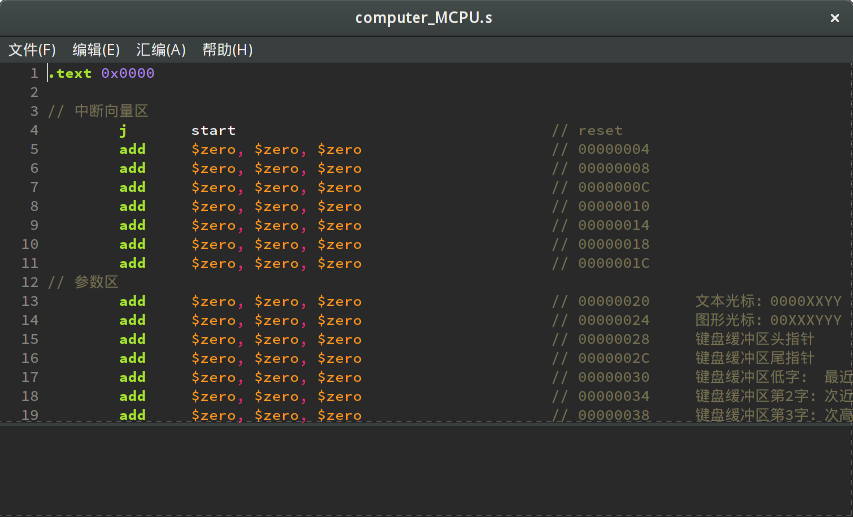

# MIPS Assembler and IDE

This is my project for Computer Organization, Shi Qingsong, Zhejiang University.

The MIPS assembler is based on the MIPS 32 specification, with some custom extensions.

The MIPS IDE is built upon SWT, packaged with launch4j for Windows executable.

## Screenshot




## Instruction set

95 Instrucitons:

- ADD
- ADDI
- ADDIU
- ADDU
- AND
- ANDI
- B
- BEQ
- BEQL
- BGEZ
- BGEZAL
- BGEZALL
- BGEZL
- BGTZ
- BGTZL
- BLEZ
- BLEZL
- BLTZ
- BLTZAL
- BLTZALL
- BLTZL
- BNE
- BNEL
- BREAK
- COP2
- DERET
- DIV
- DIVU
- ERET
- J
- JAL
- JALR
- JR
- LA
- LB
- LBU
- LDC1
- LDC2
- LH
- LHU
- LI
- LL
- LUI
- LW
- LWC1
- LWC2
- LWL
- LWR
- MFC0
- MFHI
- MFLO
- MOVE
- MOVN
- MOVZ
- MTC0
- MTHI
- MTLO
- MULT
- MULTU
- NOR
- NOP
- OR
- ORI
- PREF
- SB
- SC
- SDC1
- SDC2
- SH
- SLL
- SLLV
- SLT
- SLTI
- SLTIU
- SLTU
- SRA
- SRAV
- SRL
- SRLV
- SUB
- SUBU
- SW
- SWC1
- SWC2
- SWC3
- SWL
- SWR
- TLBP
- TLBR
- TLBWI
- TLBWR
- SYSCALL
- WAIT
- XOR
- XOR

10 directives:

- .TEXT
- .DATA
- .ASCII
- .ASCIIZ
- .BYTE
- .HALF
- .WORD
- .SPACE
- .EVAL
- .ECHO

JavaScript expression is supported for operands, while `.eval` can evaluate a JavaScript expression anywhere and `.echo` can echo the JavaScript returned string as the source code to assemble in place.

## Assemble

Numerous error checks are done during the process of assembly, including illegal operand, immediate overflow, missing or duplicate label, text and data section overlap, etc.

Available output formats include binary, COE and a debug mode.

## Disassemble

Disassembling can be done by opening a binary or COE file. All the instructions listed above and labels are supported, and multiple bytes of zero can be compressed into a `.space` directive.

## Graphical user interface

- Native GUI on Linux, Windows and Mac OSX.

- Drag-and-drop to open a file.

- Printing support.

- Line number and syntax highlighting.

## Command line interface

```
usage: mipsasm [OPTION]...
 -g,--graphical       Launch graphical user interface
 -h,--help            Display this help and exit
 -i,--input <FILE>    Read input from FILE
 -o,--output <FILE>   Write output to FILE
 -t,--terminal        Launch in terminal mode
 -w,--writer <TYPE>   Use writer of TYPE. TYPE can be 'binary', 'coe',
                      'debug' (the default), or 'hexdebug'
```

## Sample code

```mipsasm
# "Hello World" in MIPS assembly
# From: http://labs.cs.upt.ro/labs/so2/html/resources/nachos-doc/mipsf.html

	# All program code is placed after the
	# .text assembler directive
	.text 0x0

# The label 'main' represents the starting point
main:
	# Run the print_string syscall which has code 4
	li	$v0, 4		# Code for syscall: print_string
	la	$a0, msg	# Pointer to string (load the address of msg)
	syscall
	li	$v0, 10		# Code for syscall: exit
	syscall

	# All memory structures are placed after the
	# .data assembler directive
	.data 0x20

	# The .asciiz assembler directive creates
	# an ASCII string in memory terminated by
	# the null character. Note that strings are
	# surrounded by double-quotes

msg:	.asciiz	"Hello World!\n"
```
